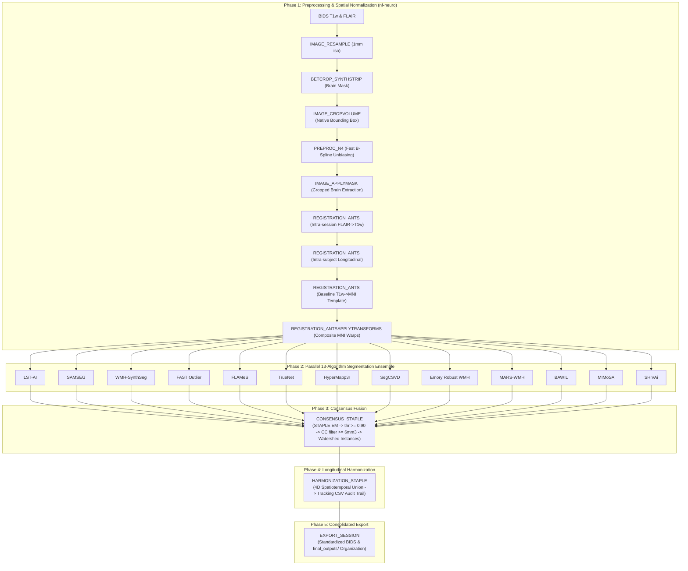

# sf-lesionflow

[](https://github.com/codespaces/new/frheault/sf-lesionflow)
[](https://www.nextflow.io/)
[](https://www.docker.com/)
[](https://sylabs.io/docs/)
[](https://www.nf-test.com)
[](https://github.com/scilus/nf-neuro)
[](https://nf-co.re)
[](https://scil.usherbrooke.ca/)
[](LICENSE)

**Multiple Sclerosis lesion segmentation and longitudinal harmonization pipeline in Nextflow DSL2.**

Developed at the **Sherbrooke Connectivity Imaging Lab (SCIL)**, Université de Sherbrooke.

---

## 1. Overview & Pipeline Architecture

`sf-lesionflow` is a reproducible, containerized Nextflow DSL2 pipeline built using the [nf-neuro](https://github.com/scilus/nf-neuro) module repository and [nf-core](https://nf-co.re) framework standards. It is designed for automated brain extraction, multi-modal registration, multi-algorithm lesion segmentation ensemble, STAPLE consensus fusion, and 4D longitudinal lesion tracking across multi-session MRI datasets.



---

## 2. Algorithm Provenance Notice

This pipeline aggregates an ensemble of 13 lesion segmentation processes, all
running their real, published/pretrained models:
`LST-AI`, `SAMSEG`, `WMH-SynthSeg`, `FAST Outlier`, `FLAMeS`, `TrueNet`,
`HyperMapp3r`, `SegCSVD`, `Emory Robust WMH`, `MARS-WMH`, `MIMoSA`, `BAWIL`,
`SHiVAi`.

See [CITATIONS.md](CITATIONS.md) for the full citation and provenance detail
of each.

---

## 3. Quickstart & Usage

### Prerequisites
* [Nextflow](https://www.nextflow.io/) (`>= 24.04.0`)
* [Docker](https://www.docker.com/) (or Singularity/Apptainer)
* [FreeSurfer License](https://surfer.nmr.mgh.harvard.edu/registration.html) (for SAMSEG)

### Running the Pipeline

```bash
nextflow run main.nf \
    --input /path/to/bids_data \
    --mni_template /path/to/mni_template.nii.gz \
    --fs_license /path/to/license.txt \
    --output results \
    -profile docker
```

### Expected Input Layout (BIDS)
```
bids_data/
└── sub-001/
    ├── ses-1/
    │   └── anat/
    │       ├── sub-001_ses-1_T1w.nii.gz
    │       └── sub-001_ses-1_FLAIR.nii.gz
    └── ses-2/
        └── anat/
            ├── sub-001_ses-2_T1w.nii.gz
            └── sub-001_ses-2_FLAIR.nii.gz
```

---

## 4. Pipeline Parameters

| Parameter | Required | Description | Default |
|---|---|---|---|
| `--input` | Yes | Path to BIDS dataset directory | `false` |
| `--mni_template` | Yes | Path to standard MNI reference brain template (`.nii.gz`) | `false` |
| `--fs_license` | Yes | Path to FreeSurfer `license.txt` | `false` |
| `--output` | No | Directory to publish output results | `results` |

---

## 5. Hardware & System Requirements

### Memory: resource labels

Every process carries one of five labels (`conf/base.config`), each with its own CPU/memory/time baseline:

| Label | CPU | Memory (attempt 1) | Time (attempt 1) |
|---|---|---|---|
| `process_single` | 1 | 4 GB | 2 h |
| `process_low` | 2 | 6 GB | 2 h |
| `process_medium` | 4 | 10 GB | 4 h |
| `process_high` | 8 | 14 GB | 6 h |
| `process_high_memory` | 4 | 20 GB | 6 h |

On the default profile (no `local_dev`), a failed task is retried up to twice (`maxRetries = 2`) with CPU/memory/time scaled by the attempt number, so a `process_high_memory` task can request as much as 60 GB (20 GB x 3) on its final retry. Size your executor's queue and per-node memory accordingly on a cluster.

### `-profile local_dev`: single-machine dev/test

`conf/local_dev.config` overrides the above for a small single-machine host (tuned for roughly 24 CPU / 24-31 GB RAM):

* Memory per label is **fixed**, not scaled by attempt (a fixed-size host can't get more RAM by retrying, so `process_high_memory` stays at 16 GB even on retry, versus scaling to 60 GB on the default profile).
* `SYNTHSTRIP_T1`/`SYNTHSTRIP_FLAIR` are capped at `maxForks = 2`.
* The heaviest segmentation processes (`SEGMENTATION_WMH_SYNTHSEG`, `SEGMENTATION_SAMSEG`, `SEGMENTATION_EMORY_ROBUST`, `SEGMENTATION_HYPERMAPP3R`) are capped at `maxForks = 1` and pinned to 16 GB, so only one of them runs at a time regardless of how many subjects/sessions are queued.

Without `-profile local_dev` (e.g. on an HPC/SLURM cluster), none of these `maxForks` caps apply, so jobs scale out across nodes as the scheduler allows.

* **Disk Space**: ~165 GB for all container images combined (measured across the current image set; `emorycn2l/emory_robust_wmh` alone is ~43 GB, the single largest). See [dockerfiles/](dockerfiles/) for individual container recipes, per-image sizes, and build instructions.
* **CPU / GPU**: Execution defaults to CPU.

---

## 6. Testing

### Fast Stub Run (DAG & Syntax Verification)
Test the entire pipeline topology without downloading heavy weights or processing data:
```bash
nextflow run main.nf \
    --input data \
    --mni_template template/mni_masked.nii.gz \
    --fs_license /path/to/license.txt \
    --output results_stub \
    -profile docker \
    -stub-run
```

---

## 7. Citations & Acknowledgements

* **Scientific Citations**: Please see [CITATIONS.md](CITATIONS.md) for full citations of all segmentation models, foundational tools, and pipeline infrastructure.
* **SCIL & nf-neuro**: This pipeline is part of the SCIL Flow family, developed and maintained at the [Sherbrooke Connectivity Imaging Lab (SCIL)](https://scil.usherbrooke.ca/), Université de Sherbrooke. It incorporates standardized neuroimaging modules and subworkflows from [nf-neuro](https://github.com/scilus/nf-neuro) and follows code and architecture standards developed by the [nf-core](https://nf-co.re) community.
