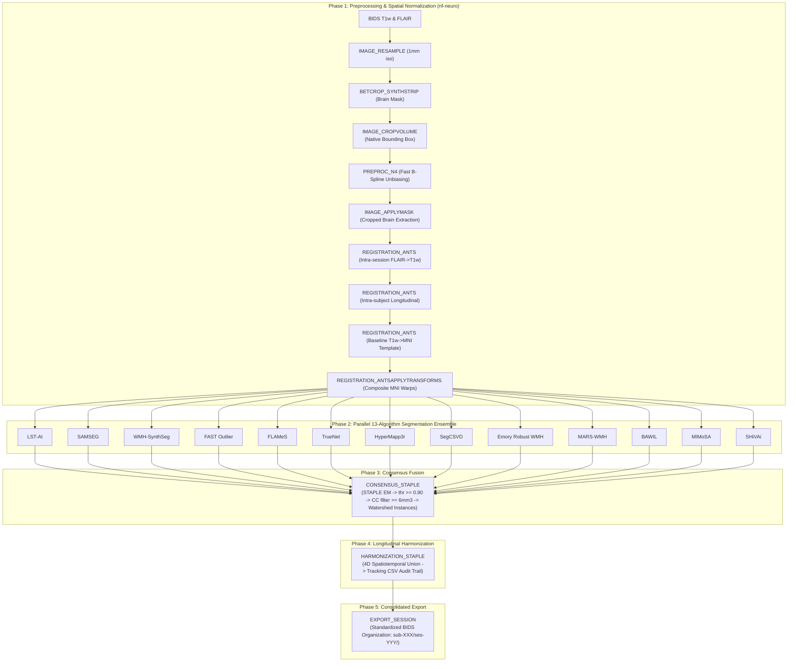

# sf-lesionflow

[](https://github.com/codespaces/new/frheault/sf-lesionflow)
[](https://www.nextflow.io/)
[](https://www.docker.com/)
[](https://sylabs.io/docs/)
[](https://www.nf-test.com)
[](https://github.com/scilus/nf-neuro)
[](https://nf-co.re)
[](https://scil.usherbrooke.ca/)
[](LICENSE)

**Multiple Sclerosis lesion segmentation and longitudinal harmonization pipeline in Nextflow DSL2.**

Developed at the **Sherbrooke Connectivity Imaging Lab (SCIL)**, Université de Sherbrooke.

---

## 1. Overview & Pipeline Architecture

`sf-lesionflow` is a reproducible, containerized Nextflow DSL2 pipeline. It uses the [nf-neuro](https://github.com/scilus/nf-neuro) module repository and [nf-core](https://nf-co.re) framework standards. The pipeline provides automated brain extraction, multimodal registration, and a 13-algorithm lesion segmentation ensemble. It performs STAPLE consensus fusion and 4D longitudinal lesion tracking across multisession MRI datasets. Six algorithms (`WMH-SynthSeg`, `FLAMeS`, `TrueNet`, `SegCSVD`, `Emory Robust WMH`, `MARS-WMH`) support optional GPU acceleration, on workstations and Slurm HPC clusters alike.



---

## 2. Algorithm Provenance Notice

This pipeline executes an ensemble of 13 lesion segmentation algorithms. Each algorithm runs its published, pretrained model.

The algorithms include: `LST-AI`, `SAMSEG`, `WMH-SynthSeg`, `FAST Outlier`, `FLAMeS`, `TrueNet`, `HyperMapp3r`, `SegCSVD`, `Emory Robust WMH`, `MARS-WMH`, `MIMoSA`, `BAWIL`, and `SHiVAi`.

Refer to [CITATIONS.md](CITATIONS.md) for complete citations and model provenance.

---

## 3. Quickstart & Usage

### Prerequisites
Install the following software prerequisites:
* [Nextflow](https://www.nextflow.io/) (`>= 24.04.0`)
* [Docker](https://www.docker.com/) (or Singularity/Apptainer)
* [FreeSurfer License](https://surfer.nmr.mgh.harvard.edu/registration.html) (for SAMSEG)
* NVIDIA GPU + [NVIDIA Container Toolkit](https://docs.nvidia.com/datacenter/cloud-native/container-toolkit/latest/install-guide.html) (optional, for GPU acceleration)

### Running the Pipeline

Run the pipeline with the following command:

```bash
nextflow run main.nf \
    --input /path/to/bids_data \
    --mni_template /path/to/mni_template.nii.gz \
    --fs_license /path/to/license.txt \
    --output results \
    -profile docker
```

To enable GPU acceleration on a workstation, add the `gpu` profile alongside a container engine profile:

```bash
nextflow run main.nf \
    --input /path/to/bids_data \
    --mni_template /path/to/mni_template.nii.gz \
    --fs_license /path/to/license.txt \
    --output results \
    -profile docker,gpu
```

To run on a Slurm HPC cluster (e.g. Alliance Canada, NIH Biowulf), combine `hpc` with `apptainer` (or `singularity`), and optionally `gpu`:

```bash
nextflow run main.nf \
    --input /path/to/bids_data \
    --mni_template /path/to/mni_template.nii.gz \
    --fs_license /path/to/license.txt \
    --output results \
    -profile hpc,apptainer,gpu
```

### Expected Input Layout (BIDS)

Organize input data according to the BIDS specification:

```
bids_data/
└── sub-001/
    ├── ses-1/
    │   └── anat/
    │       ├── sub-001_ses-1_T1w.nii.gz
    │       └── sub-001_ses-1_FLAIR.nii.gz
    └── ses-2/
        └── anat/
            ├── sub-001_ses-2_T1w.nii.gz
            └── sub-001_ses-2_FLAIR.nii.gz
```

---

## 4. Pipeline Parameters

| Parameter | Required | Description | Default |
|---|---|---|---|
| `--input` | Yes | Path to BIDS dataset directory | `false` |
| `--mni_template` | Yes | Path to standard MNI reference brain template (`.nii.gz`) | `false` |
| `--fs_license` | Yes | Path to FreeSurfer `license.txt` | `false` |
| `--output` | No | Directory to publish output results | `results` |
| `--use_gpu` | No | Run GPU-capable algorithms on GPU (also set by the `gpu` profile) | `false` |
| `--cluster_gpu_options` | No | Slurm GPU request string for the `hpc` profile, overrides default `--gres=gpu:1` | `false` |
| `--sif_cache` | No | Cache directory for pulled Apptainer/Singularity images | `false` |

---

## 5. Hardware & System Requirements

### Memory: resource labels

Each process uses one of five resource labels defined in `conf/base.config`. Each label sets baseline CPU, memory, and execution time:

| Label | CPU | Memory (attempt 1) | Time (attempt 1) |
|---|---|---|---|
| `process_single` | 1 | 4 GB | 2 h |
| `process_low` | 2 | 6 GB | 2 h |
| `process_medium` | 4 | 10 GB | 4 h |
| `process_high` | 8 | 14 GB | 6 h |
| `process_high_memory` | 4 | 20 GB | 6 h |

The default execution profile retries failed tasks up to two times (`maxRetries = 2`). Nextflow multiplies CPU, memory, and time by the attempt number. A `process_high_memory` task can request up to 60 GB memory on the final attempt. Configure executor queues and node memory to support these maximum resource requirements.

A sixth label, `process_gpu`, stacks on top of one of the labels above (e.g. `SEGMENTATION_WMH_SYNTHSEG` carries both `process_high_memory` and `process_gpu`). It sets no CPU/memory/time of its own — it only requests a GPU (`accelerator`, `clusterOptions`) when `task.ext.gpu` is true.

### GPU Acceleration

`WMH-SynthSeg`, `FLAMeS`, `TrueNet`, `SegCSVD`, `Emory Robust WMH`, and `MARS-WMH` can run on GPU. GPU use is opt-in and off by default:

* Enable it with `--use_gpu true` or the `gpu` profile (`-profile docker,gpu`). The `gpu` profile also adds the container flags needed to expose the GPU (`--gpus all` for Docker, `--nv` for Apptainer/Singularity).
* On `docker`/`apptainer`/`singularity`, the GPU comes from the local host. On `hpc` (Slurm), it's requested from the scheduler via `clusterOptions` (default `--gres=gpu:1`, override with `--cluster_gpu_options`).
* Without `--use_gpu`, all six algorithms run on CPU — no extra configuration needed.
* Exception: `SEGMENTATION_WMH_SYNTHSEG` always runs on CPU under `local_dev`, even with `--use_gpu`. On an 8 GB workstation GPU, `mri_WMHsynthseg` needs ~9-10 GB VRAM and triggers a CUDA OOM alongside the display server. It uses GPU normally under `hpc`.

### `-profile local_dev`: single-machine dev/test

`conf/local_dev.config` overrides default allocations for single-workstation execution (24 CPUs, 24-31 GB RAM):

* Memory limits stay fixed across retries. `process_high_memory` tasks use 16 GB on every attempt.
* `SYNTHSTRIP_T1` and `SYNTHSTRIP_FLAIR` are capped at `maxForks = 2`.
* Heavy segmentation processes (`SEGMENTATION_SAMSEG`, `SEGMENTATION_EMORY_ROBUST`, `SEGMENTATION_HYPERMAPP3R`, `SEGMENTATION_WMH_SYNTHSEG`) are capped at `maxForks = 1` with 16-20 GB memory, so only one runs at a time.
* GPU-capable processes are also capped at `maxForks = 1` — a single workstation GPU can't serve multiple concurrent jobs.

Cluster profiles don't enforce these caps; jobs scale across nodes according to scheduler capacity.

* **Disk Space**: Allocate ~165 GB for all container images combined. The `emorycn2l/emory_robust_wmh` image alone needs ~43 GB. See [dockerfiles/](dockerfiles/) for recipes, sizes, and build instructions.
* **CPU / GPU**: Defaults to CPU. Pass `--use_gpu true` (or the `gpu` profile) to enable GPU acceleration where supported — see [GPU Acceleration](#gpu-acceleration).

### `-profile hpc`: Slurm & shared HPC clusters

`conf/hpc.config` targets Slurm clusters (e.g. Alliance Canada Beluga/Narval/Graham, NIH Biowulf) running Apptainer/Singularity. Combine it with `apptainer` or `singularity`, and optionally `gpu`:

* Uses the `slurm` executor (`queueSize = 100`, `submitRateLimit = '10 sec'`) and `cache = 'lenient'` to tolerate timestamp jitter on distributed filesystems (Lustre/GPFS).
* Re-tunes CPU/memory/time per resource label for cluster hardware (e.g. `process_high_memory` gets 8 CPUs / 24 GB), plus per-algorithm tuning for `SEGMENTATION_SAMSEG`, `SEGMENTATION_MIMOSA`, `SEGMENTATION_WMH_SYNTHSEG`, `SEGMENTATION_HYPERMAPP3R`, `SEGMENTATION_LST_AI`, `SYNTHSTRIP_T1`/`SYNTHSTRIP_FLAIR`, the ANTs registration/N4 processes, and the STAPLE consensus/harmonization steps.
* `SEGMENTATION_WMH_SYNTHSEG` requests 16 GB / 1 h on GPU vs. 24 GB / 3 h on CPU — GPU inference finishes in ~30 s on a cluster GPU with >= 16 GB VRAM.
* GPU-capable processes request a GPU from Slurm via `clusterOptions` (default `--gres=gpu:1`, override with `--cluster_gpu_options` to match your cluster's syntax), only when `--use_gpu` is set.
* Set `--sif_cache` (or `NXF_APPTAINER_CACHEDIR`/`NXF_SINGULARITY_CACHEDIR`) to cache images on persistent, shared storage instead of the pipeline's working directory.

### Offline / air-gapped clusters (e.g. Alliance Canada)

All nine pipeline-specific containers (`frheault/sf-lesionflow-*`) are now published on DockerHub and can be pulled directly from the registry on any machine with internet access (including HPC login nodes).

`dockerfiles/build_offline_containers.sh <output_dir>` builds the whole offline cache in one run by pulling all containers — including the sf-lesionflow ones — straight from their public registries. This works on any login node that has Apptainer/Singularity and internet access (no Docker required).

Transfer `<output_dir>` to shared cluster storage (e.g. `/project` on Alliance Canada), then export `NXF_APPTAINER_CACHEDIR`/`NXF_SINGULARITY_CACHEDIR` (or pass `--sif_cache`) pointing at it, with the `offline` profile (`conf/offline.config`) added. Nextflow resolves every container — including the `frheault/sf-lesionflow-*` ones — from that cache directory automatically; `conf/offline.config` only kicks in as a developer override if you baked a locally-modified image into a `.sif` there instead of pulling the public one.

```bash
nextflow run frheault/sf-lesionflow -r main \
    --input /project/<def-group>/bids_data \
    --mni_template /project/<def-group>/mni_masked.nii.gz \
    --fs_license /project/<def-group>/license.txt \
    --output /project/<def-group>/results \
    --sif_cache /project/<def-group>/sf-lesionflow_sif \
    --use_gpu true \
    -profile hpc,apptainer,gpu,offline \
    -resume
```

---

## 6. Testing

### Fast Stub Run (DAG & Syntax Verification)
Execute a fast stub run to verify pipeline topology without data processing or model downloads:
```bash
nextflow run main.nf \
    --input data \
    --mni_template template/mni_masked.nii.gz \
    --fs_license /path/to/license.txt \
    --output results_stub \
    -profile docker \
    -stub-run
```

---

## 7. Citations & Acknowledgements

* **Scientific Citations**: Refer to [CITATIONS.md](CITATIONS.md) for full citations of all segmentation models, foundational tools, and pipeline infrastructure.
* **SCIL & nf-neuro**: This pipeline is part of the SCIL Flow family. The [Sherbrooke Connectivity Imaging Lab (SCIL)](https://scil.usherbrooke.ca/) at Université de Sherbrooke develops and maintains this pipeline. It incorporates neuroimaging modules from [nf-neuro](https://github.com/scilus/nf-neuro) and architecture standards from the [nf-core](https://nf-co.re) community.
