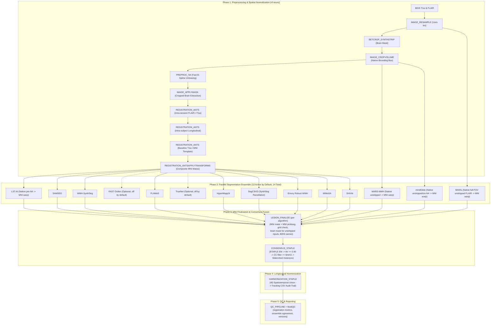

# sf-lesionflow

[](https://github.com/codespaces/new/frheault/sf-lesionflow)
[](https://www.nextflow.io/)
[](https://www.docker.com/)
[](https://sylabs.io/docs/)
[](https://www.nf-test.com)
[](https://github.com/scilus/nf-neuro)
[](https://nf-co.re)
[](https://scil.usherbrooke.ca/)
[](LICENSE)

**Multiple Sclerosis lesion segmentation and longitudinal harmonization pipeline in Nextflow DSL2.**

Developed at the **Sherbrooke Connectivity Imaging Lab (SCIL)**, Université de Sherbrooke.

---

## 1. Overview & Pipeline Architecture

`sf-lesionflow` is a reproducible, containerized Nextflow DSL2 pipeline. It uses the [nf-neuro](https://github.com/scilus/nf-neuro) module repository and [nf-core](https://nf-co.re) framework standards. The pipeline provides automated brain extraction, multimodal registration, and a multi-algorithm lesion segmentation ensemble (12 active by default, 14 total). It performs STAPLE consensus fusion and 4D longitudinal lesion tracking across multisession MRI datasets. Seven algorithms (`WMH-SynthSeg`, `FLAMeS`, `TrueNet`, `SegCSVD`, `Emory Robust WMH`, `MARS-WMH`, `mindGlide`) support optional GPU acceleration, on workstations and Slurm HPC clusters alike.


```mermaid
flowchart TD
    subgraph Phase1["Phase 1: Preprocessing & Spatial Normalization (nf-neuro)"]
        A["BIDS T1w & FLAIR"] --> B["IMAGE_RESAMPLE (1mm iso)"]
        B --> C["BETCROP_SYNTHSTRIP (Brain Mask)"]
        C --> CR["IMAGE_CROPVOLUME<br>(Native Bounding Box)"]
        CR --> D["PREPROC_N4 (Fast B-Spline Unbiasing)"]
        D --> E["IMAGE_APPLYMASK (Cropped Brain Extraction)"]
        E --> F["REGISTRATION_ANTS (Intra-session FLAIR->T1w)"]
        F --> G["REGISTRATION_ANTS (Intra-subject Longitudinal)"]
        G --> H["REGISTRATION_ANTS (Baseline T1w->MNI Template)"]
        H --> I["REGISTRATION_ANTSAPPLYTRANSFORMS (Composite MNI Warps)"]
    end

    subgraph Phase2["Phase 2: Parallel Segmentation Ensemble (12 Active by Default, 14 Total)"]
        I --> S1["LST-AI (Native pre-N4 -> MNI warp)"]
        I --> S2["SAMSEG"]
        I --> S3["WMH-SynthSeg"]
        I -.-> S4["FAST Outlier (Optional, off by default)"]
        I --> S5["FLAMeS"]
        I -.-> S6["TrueNet (Optional, off by default)"]
        I --> S7["HyperMapp3r"]
        I --> S8["SegCSVD (SynthSeg Parcellation)"]
        I --> S9["Emory Robust WMH"]
        CR --> S10["MARS-WMH (Native unstripped -> MNI warp)"]
        B --> S11["BAWIL (Native full-FOV unstripped FLAIR -> MNI warp)"]
        I --> S12["MIMoSA"]
        I --> S13["SHiVAi"]
        CR --> S14["mindGlide (Native unstripped/un-N4 -> MNI warp)"]
    end

    subgraph Phase3["Phase 3: MNI Finalization & Consensus Fusion"]
        S1 & S2 & S3 & S5 & S7 & S8 & S9 & S10 & S11 & S12 & S13 & S14 --> LF["LESION_FINALIZE (per algorithm)<br>(MNI mask + MNI probseg, grid check,<br>brain mask for unstripped inputs, BIDS names)"]
        LF --> CF["CONSENSUS_STAPLE<br>(STAPLE EM -> thr >= 0.90 -> CC filter >= 6mm3 -> Watershed Instances)"]
    end

    subgraph Phase4["Phase 4: Longitudinal Harmonization"]
        CF --> LH["HARMONIZATION_STAPLE<br>(4D Spatiotemporal Union -> Tracking CSV Audit Trail)"]
    end

    subgraph Phase5["Phase 5: QC & Reporting"]
        LH --> QC["QC_PIPELINE + MultiQC<br>(registration metrics, ensemble agreement, versions)"]
    end
```

---

## 2. Algorithm Provenance Notice

This pipeline integrates an ensemble of 14 lesion segmentation algorithms, with **12 active by default**. Eleven of the default algorithms execute published, pretrained models (`LST-AI`, `SAMSEG`, `WMH-SynthSeg`, `FLAMeS`, `HyperMapp3r`, `SegCSVD`, `Emory Robust WMH`, `MARS-WMH`, `MIMoSA`, `BAWIL`, `SHiVAi`, and `mindGlide`). 

Two algorithms are **disabled by default** and opt-in:
* `TrueNet`: Off by default due to domain shift (trained on small-vessel-disease/aging cohorts rather than MS). Enable via `--algorithms truenet,...` or `--algorithms all`.
* `FAST Outlier`: Off by default because it is an in-house unsupervised z-score heuristic based on FSL FAST tissue segmentation rather than a published/pretrained lesion model. Enable via `--algorithms fast_outlier,...` or `--algorithms all`.

To run with all 14 algorithms active, supply `--algorithms all`.

Refer to [CITATIONS.md](CITATIONS.md) for complete citations, architectural notes, and model provenance.

---

## 3. Quickstart & Usage

### Prerequisites
Install the following software prerequisites:
* [Nextflow](https://www.nextflow.io/) (`>= 24.04.0`)
* [Docker](https://www.docker.com/) (or Singularity/Apptainer)
* [FreeSurfer License](https://surfer.nmr.mgh.harvard.edu/registration.html) (for SAMSEG)
* NVIDIA GPU + [NVIDIA Container Toolkit](https://docs.nvidia.com/datacenter/cloud-native/container-toolkit/latest/install-guide.html) (optional, for GPU acceleration)

### Running the Pipeline

Run the pipeline with the following command:

```bash
nextflow run main.nf \
    --input /path/to/bids_data \
    --mni_template /path/to/mni_template.nii.gz \
    --fs_license /path/to/license.txt \
    --output results \
    -profile docker
```

To enable GPU acceleration on a workstation, add the `gpu` profile alongside a container engine profile:

```bash
nextflow run main.nf \
    --input /path/to/bids_data \
    --mni_template /path/to/mni_template.nii.gz \
    --fs_license /path/to/license.txt \
    --output results \
    -profile docker,gpu
```

To run on a Slurm HPC cluster (e.g. Alliance Canada, NIH Biowulf), combine `hpc` with `apptainer` (or `singularity`), and optionally `gpu`:

```bash
nextflow run main.nf \
    --input /path/to/bids_data \
    --mni_template /path/to/mni_template.nii.gz \
    --fs_license /path/to/license.txt \
    --output results \
    -profile hpc,apptainer,gpu
```

### Expected Input Layout (BIDS)

Organize input data according to the BIDS specification:

```
bids_data/
└── sub-001/
    ├── ses-1/
    │   └── anat/
    │       ├── sub-001_ses-1_T1w.nii.gz
    │       └── sub-001_ses-1_FLAIR.nii.gz
    └── ses-2/
        └── anat/
            ├── sub-001_ses-2_T1w.nii.gz
            └── sub-001_ses-2_FLAIR.nii.gz
```

---

## 4. Pipeline Parameters

| Parameter | Required | Description | Default |
|---|---|---|---|
| `--input` | Yes | Path to BIDS dataset directory | `false` |
| `--mni_template` | Yes | Path to standard MNI reference brain template (`.nii.gz`) | `false` |
| `--fs_license` | Yes | Path to FreeSurfer `license.txt` | `false` |
| `--output` | No | Directory to publish output results | `results` |
| `--use_gpu` | No | Run GPU-capable algorithms on GPU (also set by the `gpu` profile) | `false` |
| `--cluster_gpu_options` | No | Slurm GPU request string for the `hpc` profile, overrides default `--gres=gpu:1` | `false` |
| `--sif_cache` | No | Cache directory for pulled Apptainer/Singularity images | `false` |
| `--algorithms` / `--skip_algorithms` | No | Allow-list / deny-list of algorithms (`all` = all 14) | 12 defaults |
| `--lesion_brainmask` | No | Restrict predictions to the MNI brain mask: `unstripped` (algorithms whose input contains the skull: SAMSEG, WMH-SynthSeg, MARS-WMH, BAWIL, mindGlide), `all`, or `none` | `unstripped` |
| `--lesion_brainmask_dilation` | No | Dilation (voxels) of the brain mask before masking | `1` |
| `--template_space` | No | BIDS `space-` label of the template grid used in output names | `MNI` |
| `--publish_dir_mode` | No | Nextflow publish mode. `symlink` links `results/` into `work/`; use `copy` to archive | `symlink` |
| `--publish_intermediates` | No | Publish native preprocessing (`ses-*/preproc/`) | `true` |
| `--publish_native` | No | Also publish native-space outputs of LST-AI/TrueNet/MARS-WMH/BAWIL/mindGlide (`ses-*/native/`) | `false` |
| `--staple_threshold` | No | STAPLE consensus threshold | `0.90` |
| `--staple_min_cluster_size` | No | Minimum lesion size (voxels = mm³ on the 1 mm template grid) | `6` |
| `--pct_change_threshold` | No | % volume change separating Stable from Enlarging/Shrinking | `20.0` |

---

## 5. Outputs

All lesion outputs are on the **MNI template grid** and follow BIDS-derivatives naming. The
layout is defined in one place, [`conf/output.config`](conf/output.config) (names from
[`lib/OutputNaming.groovy`](lib/OutputNaming.groovy)):

```
results/
├── pipeline_info/            execution_{report,timeline,trace}_<date>, software_versions.yml
├── multiqc/                  cohort_multiqc_report.html (+ _data/)
└── sub-007/
    ├── ses-1/
    │   ├── anat/             sub-007_ses-1_space-MNI_desc-{brain,head}_{T1w,FLAIR}.nii.gz,
    │   │                     _desc-brain_mask.nii.gz, _desc-synthseg_dseg.nii.gz
    │   ├── lesions/          sub-007_ses-1_space-MNI_desc-<algo>_{mask.nii.gz,probseg.nii.gz,mask.json}
    │   ├── consensus/        sub-007_ses-1_space-MNI_desc-staple_{probseg,mask,dseg}.nii.gz
    │   ├── xfm/              sub-007_ses-1_from-<A>_to-<B>_mode-image_xfm.mat (ANTs)
    │   ├── qc/               QC tables/images (_desc-<kind>_qc.{tsv,png}), MARS-WMH's own report
    │   ├── multiqc/          sub-007_ses-1_multiqc_report.html
    │   ├── preproc/          native preprocessing, space-T1w / space-FLAIR (--publish_intermediates)
    │   └── native/           native-space lesion outputs (--publish_native)
    ├── ses-2/ …
    └── longitudinal/         sub-007_ses-N_space-MNI_desc-harmonized_{mask,dseg}.nii.gz,
                              sub-007_space-MNI_desc-lesiontracking.csv, qc/
```

| Entity / suffix | Meaning |
|---|---|
| `space-MNI` | MNI template grid (`--mni_template`) |
| `space-T1w` / `space-FLAIR` | native 1 mm grid of that session's T1w / FLAIR |
| `desc-<algo>` | `lstai`, `samseg`, `wmhsynthseg`, `flames`, `hypermapp3r`, `segcsvd`, `emoryrobust`, `marswmh`, `bawil`, `mimosa`, `shivai`, `mindglide` (+ `truenet`, `fastoutlier`) |
| `_mask` / `_probseg` / `_dseg` | binary lesion mask (uint8) / probability map in [0,1] (float32; FAST-outlier: `_zscore`) / lesion instance labels |
| `_mask.json` | sidecar: input space, whether the brain mask was applied, volume removed, MNI volume |

**Volumes are MNI-normalized.** Every lesion volume (per-algorithm masks, STAPLE, the
longitudinal CSV `Vol_MNI_mm3_*` columns, MultiQC `TLV_MNI_mL`) is measured on the template
grid after the *affine* normalization of the baseline T1w, i.e. head-size normalized, so
values are comparable across algorithms, sessions and subjects. All sessions of a subject
share the baseline normalization, so longitudinal changes are unaffected. The per-subject
volume scale factor (`Affine_Scale_Factor` = |det A| of the baseline→MNI affine, typically
1.5–1.8 with a 1 mm MNI template) is reported in the registration QC; native volume ≈ MNI
volume / `Affine_Scale_Factor`.

**Brain masking.** Algorithms fed images that still contain the skull (SAMSEG, WMH-SynthSeg,
MARS-WMH, BAWIL, mindGlide) have their MNI mask and probability map multiplied by the
1-voxel-dilated MNI brain mask (T1 SynthStrip mask warped to MNI) before STAPLE; the removed
volume is reported per algorithm (MultiQC "Out-of-Brain Predictions Removed", `_mask.json`).

**Symlinks.** By default (`--publish_dir_mode symlink`) `results/` holds symlinks into
`work/`: deleting `work/` or running `nextflow clean` breaks it. Re-publish with
`-resume --publish_dir_mode copy` (no recomputation) to obtain a self-contained copy.

**Upgrading from the pre-2026-09-30 layout** (process-named folders, `ses-single/`,
`staple_classical/`): use a new `--output` directory; publishing into an old tree would leave
stale links next to the new names.
---

## 6. Hardware & System Requirements

### Memory: resource labels

Each process uses one of five resource labels defined in `conf/base.config`. Each label sets baseline CPU, memory, and execution time:

| Label | CPU | Memory (attempt 1) | Time (attempt 1) |
|---|---|---|---|
| `process_single` | 1 | 4 GB | 2 h |
| `process_low` | 2 | 6 GB | 2 h |
| `process_medium` | 4 | 10 GB | 4 h |
| `process_high` | 8 | 14 GB | 6 h |
| `process_high_memory` | 4 | 20 GB | 6 h |

The default execution profile retries failed tasks up to two times (`maxRetries = 2`). Nextflow multiplies CPU, memory, and time by the attempt number. A `process_high_memory` task can request up to 60 GB memory on the final attempt. Configure executor queues and node memory to support these maximum resource requirements.

A sixth label, `process_gpu`, stacks on top of one of the labels above (e.g. `SEGMENTATION_WMH_SYNTHSEG` carries both `process_high_memory` and `process_gpu`). It sets no CPU/memory/time of its own — it only requests a GPU (`accelerator`, `clusterOptions`) when `task.ext.gpu` is true.

### GPU Acceleration

`WMH-SynthSeg`, `FLAMeS`, `TrueNet`, `SegCSVD`, `Emory Robust WMH`, `MARS-WMH`, and `mindGlide` can run on GPU. GPU use is opt-in and off by default:

* Enable it with `--use_gpu true` or the `gpu` profile (`-profile docker,gpu`). The `gpu` profile also adds the container flags needed to expose the GPU (`--gpus all` for Docker, `--nv` for Apptainer/Singularity).
* On `docker`/`apptainer`/`singularity`, the GPU comes from the local host. On `hpc` (Slurm), it's requested from the scheduler via `clusterOptions` (default `--gres=gpu:1`, override with `--cluster_gpu_options`).
* Without `--use_gpu`, all seven algorithms run on CPU — no extra configuration needed.
* Exception: `SEGMENTATION_WMH_SYNTHSEG` always runs on CPU under `local_dev`, even with `--use_gpu`. On an 8 GB workstation GPU, `mri_WMHsynthseg` needs ~9-10 GB VRAM and triggers a CUDA OOM alongside the display server. It uses GPU normally under `hpc`.

### `-profile local_dev`: single-machine dev/test

`conf/local_dev.config` overrides default allocations for single-workstation execution (24 CPUs, 24-31 GB RAM):

* Memory limits stay fixed across retries. `process_high_memory` tasks use 16 GB on every attempt.
* `SYNTHSTRIP_T1` and `SYNTHSTRIP_FLAIR` are capped at `maxForks = 2`.
* Heavy segmentation processes (`SEGMENTATION_SAMSEG`, `SEGMENTATION_EMORY_ROBUST`, `SEGMENTATION_HYPERMAPP3R`, `SEGMENTATION_WMH_SYNTHSEG`) are capped at `maxForks = 1` with 16-20 GB memory, so only one runs at a time.
* GPU-capable processes are also capped at `maxForks = 1` — a single workstation GPU can't serve multiple concurrent jobs.

Cluster profiles don't enforce these caps; jobs scale across nodes according to scheduler capacity.

### `-profile no_parallel`: strictly one task at a time

`conf/no_parallel.config` sets `executor.queueSize = 1` (and `process.maxForks = 1`), so the whole pipeline runs serially: no two tasks ever coexist. Use it on memory-bound hosts where even `local_dev`'s `queueSize = 2` lets a heavy task (e.g. `SEGMENTATION_WMH_SYNTHSEG` on CPU, ~28 GB peak) overlap with another one: `-profile docker,local_dev,no_parallel`. Slowest option; expect several hours per subject on CPU.

After a run, `tests/validate_outputs.py results --input data` checks every session's binary masks, probability maps (range, and agreement with their own binary), STAPLE, harmonization, and QC/MultiQC outputs, and exits non-zero on any failure.

* **Disk Space**: Allocate ~165 GB for all container images combined. The `emorycn2l/emory_robust_wmh` image alone needs ~43 GB. See [dockerfiles/](dockerfiles/) for recipes, sizes, and build instructions.
* **CPU / GPU**: Defaults to CPU. Pass `--use_gpu true` (or the `gpu` profile) to enable GPU acceleration where supported — see [GPU Acceleration](#gpu-acceleration).

### `-profile hpc`: Slurm & shared HPC clusters

`conf/hpc.config` targets Slurm clusters (e.g. Alliance Canada Beluga/Narval/Graham, NIH Biowulf) running Apptainer/Singularity. Combine it with `apptainer` or `singularity`, and optionally `gpu`:

* Uses the `slurm` executor (`queueSize = 100`, `submitRateLimit = '10 sec'`) and `cache = 'lenient'` to tolerate timestamp jitter on distributed filesystems (Lustre/GPFS).
* Re-tunes CPU/memory/time per resource label for cluster hardware (e.g. `process_high_memory` gets 8 CPUs / 24 GB), plus per-algorithm tuning for `SEGMENTATION_SAMSEG`, `SEGMENTATION_MIMOSA`, `SEGMENTATION_WMH_SYNTHSEG`, `SEGMENTATION_HYPERMAPP3R`, `SEGMENTATION_LST_AI`, `SYNTHSTRIP_T1`/`SYNTHSTRIP_FLAIR`, the ANTs registration/N4 processes, and the STAPLE consensus/harmonization steps.
* `SEGMENTATION_WMH_SYNTHSEG` requests 16 GB / 1 h on GPU vs. 24 GB / 3 h on CPU — GPU inference finishes in ~30 s on a cluster GPU with >= 16 GB VRAM.
* GPU-capable processes request a GPU from Slurm via `clusterOptions` (default `--gres=gpu:1`, override with `--cluster_gpu_options` to match your cluster's syntax), only when `--use_gpu` is set.
* Set `--sif_cache` (or `NXF_APPTAINER_CACHEDIR`/`NXF_SINGULARITY_CACHEDIR`) to cache images on persistent, shared storage instead of the pipeline's working directory.

### Offline / air-gapped clusters (e.g. Alliance Canada)

All nine pipeline-specific containers (`frheault/sf-lesionflow-*`) are now published on DockerHub and can be pulled directly from the registry on any machine with internet access (including HPC login nodes).

`dockerfiles/build_offline_containers.sh <output_dir>` builds the whole offline cache in one run by pulling all containers — including the sf-lesionflow ones — straight from their public registries. This works on any login node that has Apptainer/Singularity and internet access (no Docker required).

Transfer `<output_dir>` to shared cluster storage (e.g. `/project` on Alliance Canada), then export `NXF_APPTAINER_CACHEDIR`/`NXF_SINGULARITY_CACHEDIR` (or pass `--sif_cache`) pointing at it, with the `offline` profile (`conf/offline.config`) added. Nextflow resolves every container — including the `frheault/sf-lesionflow-*` ones — from that cache directory automatically; `conf/offline.config` only kicks in as a developer override if you baked a locally-modified image into a `.sif` there instead of pulling the public one.

```bash
nextflow run frheault/sf-lesionflow -r main \
    --input /project/<def-group>/bids_data \
    --mni_template /project/<def-group>/mni_masked.nii.gz \
    --fs_license /project/<def-group>/license.txt \
    --output /project/<def-group>/results \
    --sif_cache /project/<def-group>/sf-lesionflow_sif \
    --use_gpu true \
    -profile hpc,apptainer,gpu,offline \
    -resume
```

---

## 7. Testing

### Fast Stub Run (DAG & Syntax Verification)
Execute a fast stub run to verify pipeline topology without data processing or model downloads:
```bash
nextflow run main.nf \
    --input data \
    --mni_template template/mni_masked.nii.gz \
    --fs_license /path/to/license.txt \
    --output results_stub \
    -profile docker \
    -stub-run
```

### Unit tests and output validation
```bash
python3 -m pytest -q tests/                         # QC, finalize, registration-metric and BAWIL geometry tests
python3 tests/validate_outputs.py results --input data   # end-to-end check of a finished results/ tree
```
`validate_outputs.py` checks the layout (no broken links, no unprefixed files), grids, mask/probseg
consistency, soft probability maps, brain containment, inter-algorithm agreement outliers,
registration metrics and software versions; it exits non-zero on any FAIL.

---

## 8. Citations & Acknowledgements

* **Scientific Citations**: Refer to [CITATIONS.md](CITATIONS.md) for full citations of all segmentation models, foundational tools, and pipeline infrastructure.
* **SCIL & nf-neuro**: This pipeline is part of the SCIL Flow family. The [Sherbrooke Connectivity Imaging Lab (SCIL)](https://scil.usherbrooke.ca/) at Université de Sherbrooke develops and maintains this pipeline. It incorporates neuroimaging modules from [nf-neuro](https://github.com/scilus/nf-neuro) and architecture standards from the [nf-core](https://nf-co.re) community.
